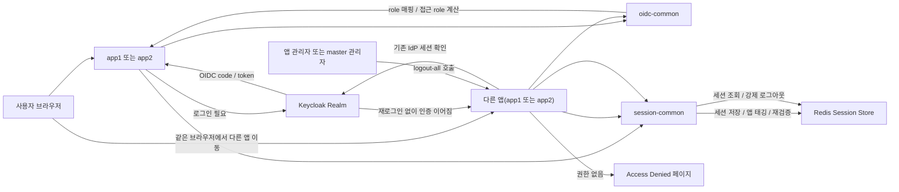
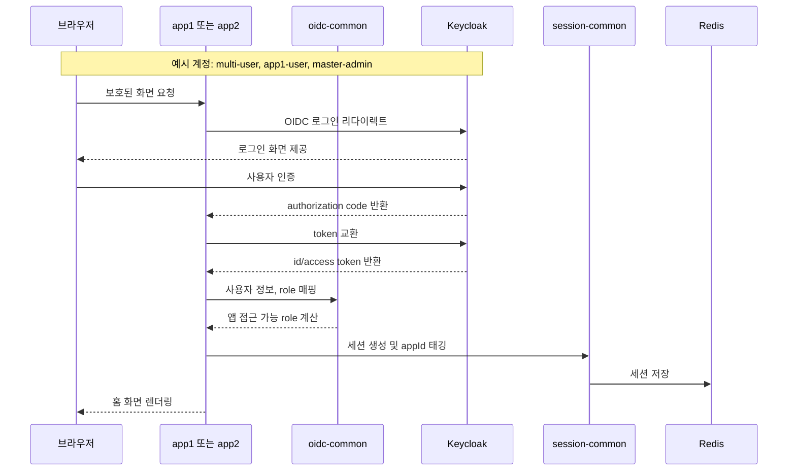
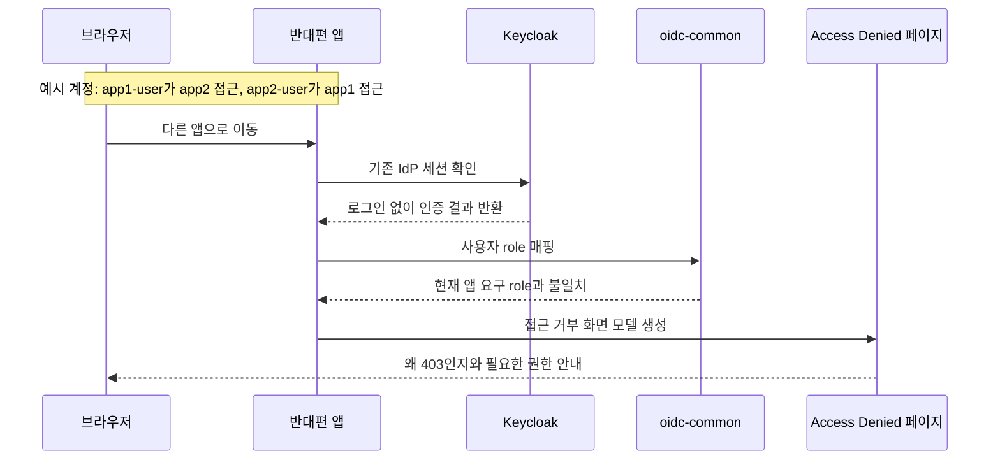
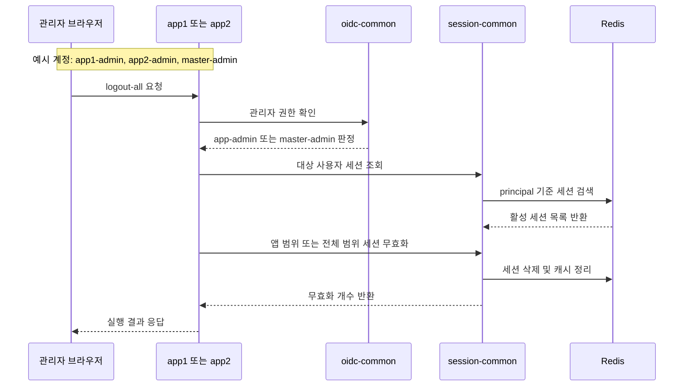

# OIDC Multi App Example

`oidc-simple-example`를 기반으로, 하나의 Keycloak realm을 두 개의 독립 Spring Boot 앱이 함께 신뢰하는 멀티앱 예제입니다.

현재 구조는 `app1`, `app2`, `oidc-common`, `session-common` 4모듈로 나뉘어 있으며, OIDC 로그인 책임과 세션 운영 책임을 분리해서 보여줍니다.

## Repository Links

- 기본 SSO 예제 경로: [oidc-multi-app-example](https://github.com/ydj515/sample-repository-example/tree/main/oidc-multi-app-example)
- Gateway HMAC 확장 예제 경로: [oidc-multi-app-hmac-gateway-example](https://github.com/ydj515/sample-repository-example/tree/main/oidc-multi-app-hmac-gateway-example)

## 구성

| 모듈/서비스 | 역할 | 포함 책임 | 대표 예시 |
| --- | --- | --- | --- |
| `app1` | 첫 번째 실행 앱 | App 1 화면, API, app1 전용 설정, app1 client 연결 | 포트 `8081`, client `oidc-app1` |
| `app2` | 두 번째 실행 앱 | App 2 화면, API, app2 전용 설정, app2 client 연결 | 포트 `8082`, client `oidc-app2` |
| `oidc-common` | 공통 OIDC 보안 모듈 | OIDC 로그인, Keycloak 사용자 매핑, logout 처리, 접근 role 계산 | `SecurityFilterChain`, `OidcUserService` |
| `session-common` | 공통 세션 모듈 | Redis 세션 저장, 세션 조회, 세션 재검증, 앱별 세션 태깅, 세션 정책, Boot 자동 설정 | `SessionCommonAutoConfiguration`, `SessionLookupService` |
| `postgres` | Keycloak DB | realm, client, 사용자, 세션 관련 Keycloak 영속 데이터 저장 | PostgreSQL 14 |
| `redis` | 세션 저장소 | Spring Session 저장 | Redis 7 |
| `keycloak` | 공통 IdP | realm, client, 사용자/role 발급, IdP 세션 유지 | Keycloak 26 + PostgreSQL |

## 모듈 설명

### `app1`

- 사용자가 직접 접속하는 첫 번째 서비스입니다.
- App 1 홈 화면, 접근 거부 페이지, App 1 API를 가집니다.
- `oidc-common`, `session-common`을 조립해서 실행합니다.

### `app2`

- 사용자가 직접 접속하는 두 번째 서비스입니다.
- App 2 홈 화면, 접근 거부 페이지, App 2 API를 가집니다.
- `app1`과 다른 client와 쿠키를 사용하지만 같은 Keycloak realm을 신뢰합니다.

### `oidc-common`

- OIDC 보안에만 집중한 공통 모듈입니다.
- 포함 내용:
  - 공통 `SecurityFilterChain`
  - Keycloak role/authority 매핑
  - OIDC logout redirect 처리
  - 앱 접근 role, 관리자 role 계산
- 의도적으로 포함하지 않는 것:
  - Redis 세션 저장/조회
  - 세션 재검증 TTL 정책
  - 세션 태깅과 세션 무효화 범위

### `session-common`

- 세션 운영 정책에만 집중한 공통 모듈입니다.
- 포함 내용:
  - Redis 기반 Spring Session 설정
  - 세션 조회와 강제 로그아웃
  - 앱별 세션 태깅
  - API 중요도별 세션 재검증 정책
  - `SessionCommonAutoConfiguration`을 통한 자동 빈 등록
- 이 모듈이 따로 있는 이유:
  - OIDC 설명과 세션 운영 설명의 관심사가 다르기 때문입니다.
  - 세션 정책이 커질수록 `oidc-common`과 분리하는 편이 더 읽기 쉽고 유지보수도 편합니다.

## 자동 설정 방식

- `session-common`은 `SessionCommonAutoConfiguration`을 통해 붙습니다.
- 앱은 `com.example.sessioncommon` 패키지를 직접 스캔하지 않아도 됩니다.
- 필요한 것은 두 가지입니다.
  - `implementation(project(":session-common"))`
  - `app.session.*` 설정
- 기본 빈이 이미 등록되지만, 필요하면 같은 타입의 빈을 앱에서 직접 선언해 교체할 수 있습니다.

## 빠른 실행

```bash
docker compose up --build
```

접속 주소:

- app1: `http://localhost:8081`
- app2: `http://localhost:8082`
- Keycloak: `http://localhost:9000`

선택 환경 변수:

- `KEYCLOAK_DB_NAME` 기본값: `keycloak`
- `KEYCLOAK_DB_USER` 기본값: `keycloak`
- `KEYCLOAK_DB_PASSWORD` 기본값: `keycloak`

## 예제 계정

- app1 전용 사용자
  - 아이디: `app1-user`
  - 비밀번호: `app1user1234`
- app1, app2 공용 사용자
  - 아이디: `multi-user`
  - 비밀번호: `multi1234`
- app2 전용 사용자
  - 아이디: `app2-user`
  - 비밀번호: `app2user1234`
- app1 관리자
  - 아이디: `app1-admin`
  - 비밀번호: `app1admin1234`
- app2 관리자
  - 아이디: `app2-admin`
  - 비밀번호: `app2admin1234`
- master 관리자
  - 아이디: `master-admin`
  - 비밀번호: `master1234`

## 확인 흐름

1. `http://localhost:8081`에서 로그인합니다.
2. 같은 브라우저에서 `http://localhost:8082`로 이동합니다.
3. `multi-user` 또는 `master-admin`으로 로그인했다면 app2에서도 인증 흐름이 자연스럽게 이어집니다.
4. `app1-user`는 app2에서, `app2-user`는 app1에서 403으로 차단됩니다.

## 실행 흐름



- `oidc-common`은 로그인, role 매핑, 접근 권한 판단을 담당합니다.
- `session-common`은 세션 저장, 세션 재검증, 앱 범위 세션 무효화를 담당합니다.
- `multi-user`, `master-admin`은 두 앱 사이 SSO 흐름이 이어지고, 앱 전용 계정은 반대편 앱에서 접근 거부 페이지로 이동합니다.

## 상세 시퀀스

### 로그인



### Access Denied



### Admin Logout



## 이 예제가 보여주는 포인트

- `app1`, `app2`는 서로 다른 앱입니다.
- 두 앱은 같은 Keycloak realm을 신뢰합니다.
- 각 앱은 서로 다른 client와 서로 다른 세션 쿠키를 사용합니다.
- 사용자는 IdP 세션을 기반으로 두 앱 사이를 자연스럽게 오갈 수 있습니다.
- 앱별 관리자와 master 관리자는 세션 종료 범위가 다릅니다.

## 로컬 실행

Keycloak과 Redis만 먼저 띄운 뒤, 각 앱을 별도로 실행할 수 있습니다.

```bash
docker compose up keycloak redis postgres
./gradlew :app1:bootRun --args='--spring.profiles.active=local'
./gradlew :app2:bootRun --args='--spring.profiles.active=local'
```

## 수동 Playwright 회귀 점검

- 이 예제는 브라우저 검증을 기본 빌드나 `./gradlew test`에 묶지 않습니다.
- 대신 접근 거부 화면과 정적 리소스 공개 설정을 수정했을 때만 수동으로 돌리는 Playwright 스크립트를 제공합니다.
- 스크립트 위치: `scripts/playwright/check-access-denied-regression.sh`

실행 예시:

```bash
./scripts/playwright/check-access-denied-regression.sh
```

헤드 있는 브라우저로 보고 싶을 때:

```bash
HEADED=true ./scripts/playwright/check-access-denied-regression.sh
```

이 스크립트는 아래 두 시나리오를 검증합니다.

- `app2-user`가 `app1`에 로그인해서 `App 1 Access Denied` 화면이 스타일과 함께 렌더링되는지
- `app1-user`가 `app2`에 로그인해서 `App 2 Access Denied` 화면이 스타일과 함께 렌더링되는지

검증 결과물은 `output/playwright/access-denied/<timestamp>/` 아래에 스크린샷과 로그로 저장됩니다.

## 주요 엔드포인트

- `GET /public`
- `GET /api/me`
- `GET /api/sensitive`
- `POST /api/admin/users/{username}/logout-all`
