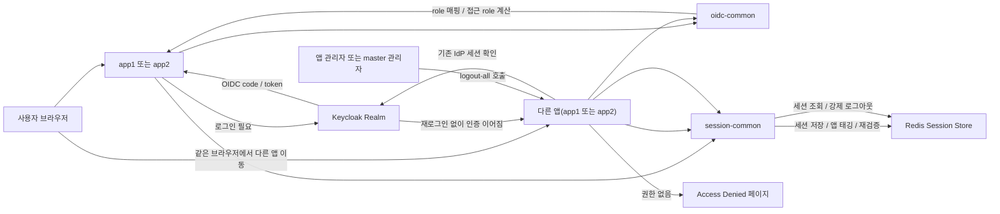
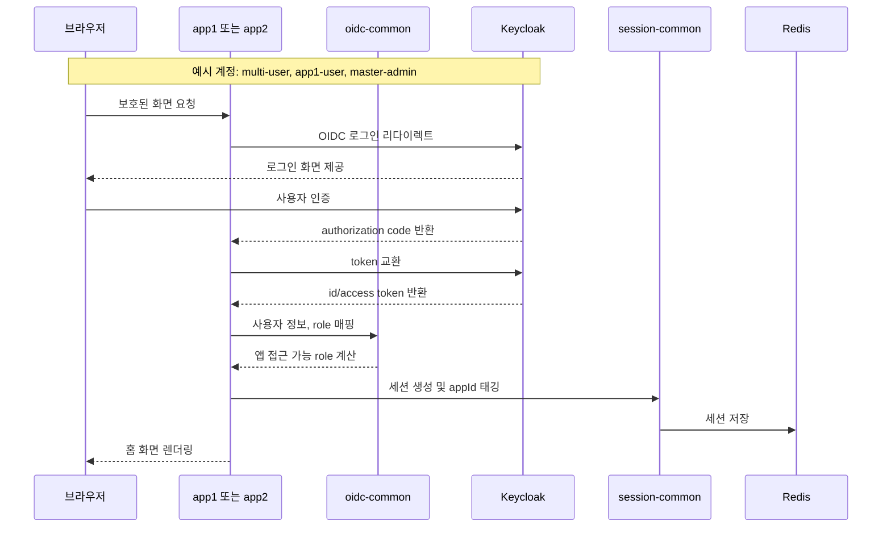
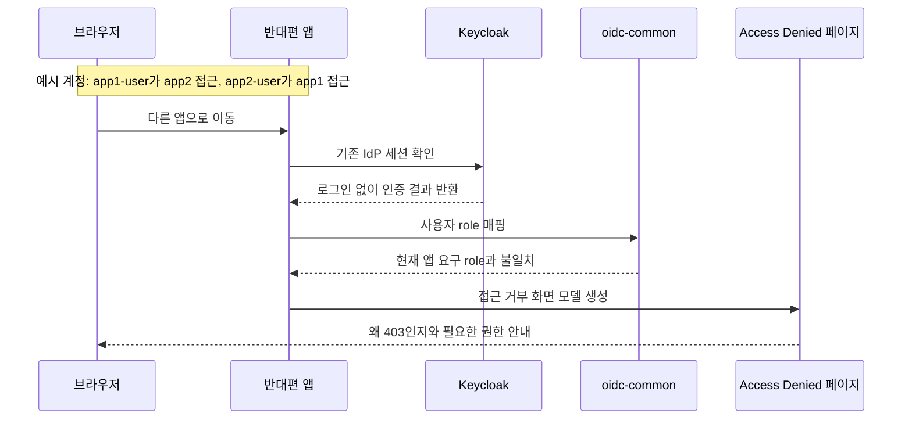
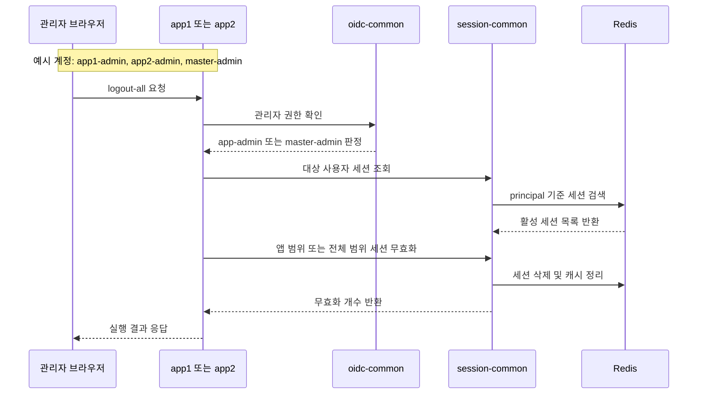

# OIDC Multi App Example

`oidc-simple-example`를 기반으로, 하나의 Keycloak realm을 두 개의 독립 Spring Boot 앱이 함께 신뢰하는 멀티 앱 SSO 기본 예제입니다.

이 예제는 `app1`, `app2` 같은 generic naming을 그대로 유지합니다. 특정 산업이나 기관 도메인으로의 해석은 문서 밖에서 덧붙일 수 있지만, 샘플 자체는 "공통 IdP + 앱별 OIDC client + 앱별 세션 쿠키 + role 기반 접근 제어"라는 기술 구조를 가장 단순하게 보여주는 데 집중합니다.

현재 구조는 `app1`, `app2`, `oidc-common`, `session-common` 4모듈로 나뉘어 있으며, OIDC 로그인 책임과 세션 운영 책임을 분리해서 보여줍니다.

## Repository Links

- 전체 저장소: [sample-repository-example](https://github.com/ydj515/sample-repository-example)
- 기본 SSO 예제 경로: [oidc-multi-app-example](https://github.com/ydj515/sample-repository-example/tree/main/oidc-multi-app-example)
- Gateway HMAC 확장 예제 경로: [oidc-multi-app-hmac-gateway-example](https://github.com/ydj515/sample-repository-example/tree/main/oidc-multi-app-hmac-gateway-example)

## 이 예제가 다루는 문제

- 같은 IdP를 신뢰하는 여러 앱이 어떻게 각자 다른 OIDC client와 세션 쿠키를 유지하면서도 SSO를 이룰 수 있는가
- App1에서 로그인한 뒤 App2로 이동했을 때 왜 비밀번호를 다시 묻지 않는가
- SSO가 되었더라도 왜 App2 role이 없는 사용자는 App2에서 `403`을 받는가
- 앱 관리자와 전체 관리자의 세션 무효화 범위를 어떻게 분리할 것인가

## 런타임 모델

실제 운영 환경에서는 아래처럼 읽으면 됩니다.

| 로컬 데모 | 운영 예시 |
| --- | --- |
| `http://localhost:8081` | `https://app1.example.com` |
| `http://localhost:8082` | `https://app2.example.com` |
| `http://localhost:9000` | `https://sso.example.com` |
| `oidc-app1` | App1용 OIDC client |
| `oidc-app2` | App2용 OIDC client |
| `APP1SESSION` | App1 서비스 세션 |
| `APP2SESSION` | App2 서비스 세션 |

여기서 SSO는 `APP1SESSION`을 App2가 그대로 재사용한다는 뜻이 아닙니다. 사용자가 App1에서 로그인하면 브라우저에 공통 IdP 세션이 생기고, App2로 이동했을 때 App2가 다시 Keycloak으로 리다이렉트하더라도 Keycloak이 기존 IdP 세션을 확인해 재로그인 없이 authorization code를 발급하는 구조입니다.

## 구성

| 모듈/서비스 | 역할 | 포함 책임 | 대표 예시 |
| --- | --- | --- | --- |
| `app1` | 첫 번째 실행 앱 | App 1 화면, API, app1 전용 설정, app1 client 연결 | 포트 `8081`, client `oidc-app1` |
| `app2` | 두 번째 실행 앱 | App 2 화면, API, app2 전용 설정, app2 client 연결 | 포트 `8082`, client `oidc-app2` |
| `oidc-common` | 공통 OIDC 보안 모듈 | OIDC 로그인, Keycloak 사용자 매핑, logout 처리, 접근 role 계산 | `SecurityFilterChain`, `OidcUserService` |
| `session-common` | 공통 세션 모듈 | Redis 세션 저장, 세션 조회, 세션 재검증, 앱별 세션 태깅, 세션 정책, Boot 자동 설정 | `SessionCommonAutoConfiguration`, `SessionLookupService` |
| `postgres` | Keycloak DB | realm, client, 사용자, 세션 관련 Keycloak 영속 데이터 저장 | PostgreSQL 14 |
| `redis` | 세션 저장소 | Spring Session 저장 | Redis 7 |
| `keycloak` | 공통 IdP | realm, client, 사용자/role 발급, IdP 세션 유지 | Keycloak 26 + PostgreSQL |

## 왜 4모듈로 시작하나

이 기본형에서는 일부러 Gateway를 넣지 않았습니다. 멀티 앱 SSO를 설명할 때 가장 먼저 이해해야 할 것은 "같은 IdP 세션을 기반으로 각 앱이 자기 client와 자기 cookie를 만든다"는 점이기 때문입니다. 여기에 Gateway나 내부 HMAC 검증까지 한 번에 넣으면, 독자가 SSO 자체보다 프록시와 내부 호출 보안에 먼저 시선을 빼앗기기 쉽습니다.

책임은 아래처럼 분리합니다.

- `oidc-common`은 "사용자가 누구인지, 어떤 role을 가졌는지"를 다룹니다.
- `session-common`은 "현재 앱에서 만든 세션이 아직 유효한지"를 다룹니다.
- `app1`, `app2`는 각자의 client, cookie, 접근 role만 설정하고 공통 로직을 조립합니다.

## 모듈 설명

### `app1`

- 사용자가 직접 접속하는 첫 번째 서비스입니다.
- App 1 홈 화면, 접근 거부 페이지, App 1 API를 가집니다.
- `oidc-common`, `session-common`을 조립해서 실행합니다.

### `app2`

- 사용자가 직접 접속하는 두 번째 서비스입니다.
- App 2 홈 화면, 접근 거부 페이지, App 2 API를 가집니다.
- `app1`과 다른 client와 쿠키를 사용하지만 같은 Keycloak realm을 신뢰합니다.

### `oidc-common`

- OIDC 보안에만 집중한 공통 모듈입니다.
- 포함 내용:
  - 공통 `SecurityFilterChain`
  - Keycloak role/authority 매핑
  - OIDC logout redirect 처리
  - 앱 접근 role, 관리자 role 계산
- 의도적으로 포함하지 않는 것:
  - Redis 세션 저장/조회
  - 세션 재검증 TTL 정책
  - 세션 태깅과 세션 무효화 범위

### `session-common`

- 세션 운영 정책에만 집중한 공통 모듈입니다.
- 포함 내용:
  - Redis 기반 Spring Session 설정
  - 세션 조회와 강제 로그아웃
  - 앱별 세션 태깅
  - API 중요도별 세션 재검증 정책
  - `SessionCommonAutoConfiguration`을 통한 자동 빈 등록
- 이 모듈이 따로 있는 이유:
  - OIDC 설명과 세션 운영 설명의 관심사가 다르기 때문입니다.
  - 세션 정책이 커질수록 `oidc-common`과 분리하는 편이 더 읽기 쉽고 유지보수도 편합니다.

## 자동 설정 방식

- `session-common`은 `SessionCommonAutoConfiguration`을 통해 붙습니다.
- 앱은 `com.example.sessioncommon` 패키지를 직접 스캔하지 않아도 됩니다.
- 필요한 것은 두 가지입니다.
  - `implementation(project(":session-common"))`
  - `app.session.*` 설정
- 기본 빈이 이미 등록되지만, 필요하면 같은 타입의 빈을 앱에서 직접 선언해 교체할 수 있습니다.

## 앱별 client와 세션 쿠키 분리

두 앱은 같은 Keycloak realm을 신뢰하지만 서로 다른 client와 세션 쿠키를 사용합니다. 이 분리가 있어야 각 앱이 독립적인 서비스 경계와 권한 모델을 유지할 수 있습니다.

```yaml
# app1
server:
  port: 8081
  servlet:
    session:
      cookie:
        name: APP1SESSION

app:
  session:
    app-id: app1
  security:
    logout-cookie-name: APP1SESSION
    access:
      user-roles:
        - app1-user
      admin-roles:
        - app1-admin
      master-admin-role: master-admin
```

```yaml
# app2
server:
  port: 8082
  servlet:
    session:
      cookie:
        name: APP2SESSION

app:
  session:
    app-id: app2
  security:
    logout-cookie-name: APP2SESSION
    access:
      user-roles:
        - app2-user
      admin-roles:
        - app2-admin
      master-admin-role: master-admin
```

즉, 사용자는 "하나의 SSO"를 경험하지만 실제 서비스 내부에서는 App1과 App2가 각자 별도 세션을 만들고, 각자 자기 role 기준으로 접근을 판단합니다.

## 빠른 실행

```bash
docker compose up --build
```

접속 주소:

- app1: `http://localhost:8081`
- app2: `http://localhost:8082`
- Keycloak: `http://localhost:9000`

선택 환경 변수:

- `KEYCLOAK_DB_NAME` 기본값: `keycloak`
- `KEYCLOAK_DB_USER` 기본값: `keycloak`
- `KEYCLOAK_DB_PASSWORD` 기본값: `keycloak`

## 예제 계정

- app1 전용 사용자
  - 아이디: `app1-user`
  - 비밀번호: `app1user1234`
- app1, app2 공용 사용자
  - 아이디: `multi-user`
  - 비밀번호: `multi1234`
- app2 전용 사용자
  - 아이디: `app2-user`
  - 비밀번호: `app2user1234`
- app1 관리자
  - 아이디: `app1-admin`
  - 비밀번호: `app1admin1234`
- app2 관리자
  - 아이디: `app2-admin`
  - 비밀번호: `app2admin1234`
- master 관리자
  - 아이디: `master-admin`
  - 비밀번호: `master1234`

## 권한 모델과 세션 범위

이 예제는 SSO와 인가가 다른 문제라는 점을 보여주기 위해 사용자 종류를 나누었습니다.

| 사용자 | App1 접근 | App2 접근 | 세션 무효화 범위 |
| --- | --- | --- | --- |
| `app1-user` | 가능 | 거부 | 없음 |
| `app2-user` | 거부 | 가능 | 없음 |
| `multi-user` | 가능 | 가능 | 없음 |
| `app1-admin` | 가능 | 거부 | App1 세션만 관리 |
| `app2-admin` | 거부 | 가능 | App2 세션만 관리 |
| `master-admin` | 가능 | 가능 | 전체 앱 세션 관리 |

핵심은 SSO가 되었더라도 앱별 role이 없으면 반대편 앱에서는 자동으로 권한이 생기지 않는다는 점입니다. 그래서 `app1-user`가 App2로 이동할 때는 재로그인 없이 인증은 이어지지만, 인가 단계에서 `403`이 발생합니다.

## 확인 흐름

1. `http://localhost:8081`에서 로그인합니다.
2. 같은 브라우저에서 `http://localhost:8082`로 이동합니다.
3. `multi-user` 또는 `master-admin`으로 로그인했다면 App2에서도 인증 흐름이 자연스럽게 이어집니다.
4. `app1-user`는 App2에서, `app2-user`는 App1에서 `403`으로 차단됩니다.

## 실행 흐름



- `oidc-common`은 로그인, role 매핑, 접근 권한 판단을 담당합니다.
- `session-common`은 세션 저장, 세션 재검증, 앱 범위 세션 무효화를 담당합니다.
- `multi-user`, `master-admin`은 두 앱 사이 SSO 흐름이 이어지고, 앱 전용 계정은 반대편 앱에서 접근 거부 페이지로 이동합니다.

## 상세 시퀀스

### 로그인



이 시퀀스에서 핵심은 인증이 Keycloak에서 끝나더라도, 실제 애플리케이션이 사용하는 로그인 상태는 각 앱이 Redis에 저장한 자기 세션이라는 점입니다. 그래서 App1과 App2는 같은 IdP를 신뢰하면서도 서로 다른 세션 쿠키와 권한 정책을 유지할 수 있고, 브라우저는 기존 IdP 세션 덕분에 다른 앱으로 이동할 때 재로그인 없이 인증을 이어갈 수 있습니다.

### Access Denied



### Admin Logout



## 언제 6모듈 확장형으로 넘어가나

이 4모듈 기본형만으로도 멀티 앱 SSO의 핵심은 충분히 설명할 수 있습니다. 다만 아래 조건이 생기면 `oidc-multi-app-hmac-gateway-example` 확장형으로 넘어가는 편이 맞습니다.

- App1/App2 API 앞단에 공통 Gateway를 두고 싶다.
- Backend가 "이 요청이 정말 Gateway를 거쳐 왔는가"까지 검증해야 한다.
- 외부에서 Backend로 직접 들어오는 경로나 내부 헤더 위조 가능성까지 방어하고 싶다.

확장형은 여기에 `gateway`, `internal-auth-common`을 추가해서 Gateway가 내부 HMAC 헤더를 만들고 Backend가 다시 검증하는 구조를 보여줍니다. 즉, 4모듈은 "SSO 자체", 6모듈은 "SSO + 내부 API 신뢰 경계"에 초점을 둔 예제입니다.

## 로컬 실행

Keycloak과 Redis만 먼저 띄운 뒤, 각 앱을 별도로 실행할 수 있습니다.

```bash
docker compose up keycloak redis postgres
./gradlew :app1:bootRun --args='--spring.profiles.active=local'
./gradlew :app2:bootRun --args='--spring.profiles.active=local'
```

## 수동 Playwright 회귀 점검

- 이 예제는 브라우저 검증을 기본 빌드나 `./gradlew test`에 묶지 않습니다.
- 대신 접근 거부 화면과 정적 리소스 공개 설정을 수정했을 때만 수동으로 돌리는 Playwright 스크립트를 제공합니다.
- 스크립트 위치: `scripts/playwright/check-access-denied-regression.sh`

실행 예시:

```bash
./scripts/playwright/check-access-denied-regression.sh
```

헤드 있는 브라우저로 보고 싶을 때:

```bash
HEADED=true ./scripts/playwright/check-access-denied-regression.sh
```

이 스크립트는 아래 두 시나리오를 검증합니다.

- `app2-user`가 `app1`에 로그인해서 `App 1 Access Denied` 화면이 스타일과 함께 렌더링되는지
- `app1-user`가 `app2`에 로그인해서 `App 2 Access Denied` 화면이 스타일과 함께 렌더링되는지

검증 결과물은 `output/playwright/access-denied/<timestamp>/` 아래에 스크린샷과 로그로 저장됩니다.

## 주요 엔드포인트

- `GET /public`
- `GET /api/me`
- `GET /api/sensitive`
- `POST /api/admin/users/{username}/logout-all`
