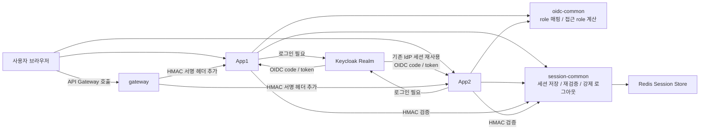
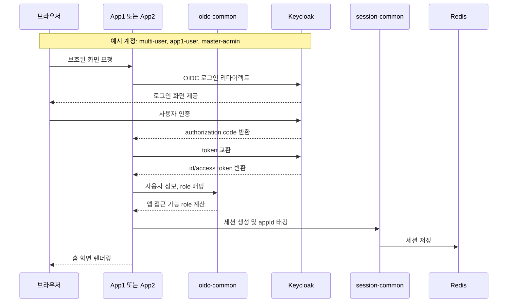
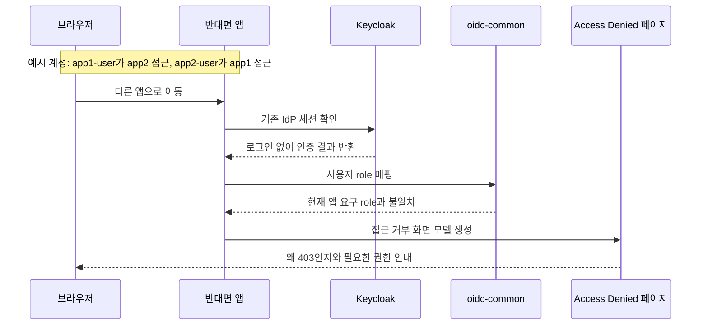
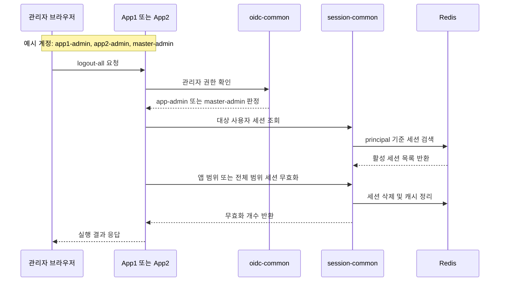
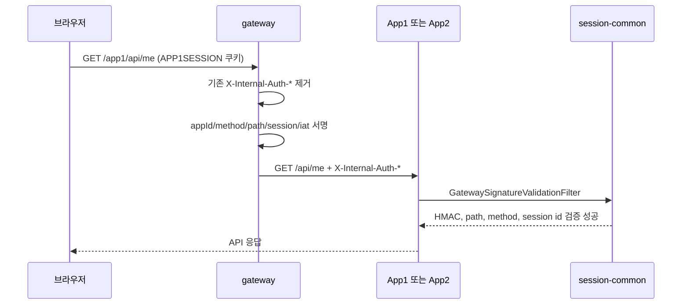

# OIDC Multi App HMAC Gateway Example

`oidc-multi-app-example` 기본 SSO 샘플을 기반으로, Gateway가 내부 HMAC 헤더를 붙이고 Backend가 이를 다시 검증하는 확장 예제입니다.

이 예제는 `app1`, `app2`, `gateway` 같은 generic naming을 그대로 유지합니다. 특정 도메인이나 산업에 대한 해석은 문서 밖에서 덧붙일 수 있지만, 샘플 자체는 "여러 앱 + 공통 IdP + Gateway/Backend 신뢰 경계"라는 기술 구조에만 집중합니다.

## Repository Links

- 전체 저장소: [sample-repository-example](https://github.com/ydj515/sample-repository-example)
- 기본 SSO 예제 경로: [oidc-multi-app-example](https://github.com/ydj515/sample-repository-example/tree/main/oidc-multi-app-example)
- 현재 확장 예제 경로: [oidc-multi-app-hmac-gateway-example](https://github.com/ydj515/sample-repository-example/tree/main/oidc-multi-app-hmac-gateway-example)

## 구성

| 모듈/서비스 | 역할 | 포함 책임 | 대표 예시 |
| --- | --- | --- | --- |
| `gateway` | API Gateway | App1/App2 API 프록시, 내부 HMAC 헤더 생성, 외부 주입 헤더 제거 | 포트 `8080`, `/app1/**`, `/app2/**` |
| `app1` | App1 서비스 | App1 화면, API, App1 client 연결 | 포트 `8081`, client `oidc-app1`, 쿠키 `APP1SESSION` |
| `app2` | App2 서비스 | App2 화면, API, App2 client 연결 | 포트 `8082`, client `oidc-app2`, 쿠키 `APP2SESSION` |
| `oidc-common` | 공통 OIDC 보안 모듈 | OIDC 로그인, Keycloak 사용자 매핑, logout 처리, 접근 role 계산 | `SecurityFilterChain`, `OidcUserService` |
| `session-common` | 공통 세션 모듈 | Redis 세션 저장, 세션 조회, 세션 재검증, 앱별 세션 태깅, Gateway HMAC 검증, Boot 자동 설정 | `SessionCommonAutoConfiguration`, `SessionLookupService`, `GatewaySignatureValidationFilter` |
| `internal-auth-common` | 내부 인증 공통 모듈 | Gateway와 Backend가 공유하는 HMAC payload/header/signature 규칙 | `InternalAuthSigner`, `InternalAuthPayload` |
| `postgres` | Keycloak DB | realm, client, 사용자, 세션 관련 Keycloak 영속 데이터 저장 | PostgreSQL 14 |
| `redis` | 세션 저장소 | Spring Session 저장 | Redis 7 |
| `keycloak` | 공통 IdP | realm, client, 사용자/role 발급, IdP 세션 유지 | Keycloak 26 + PostgreSQL |

## 런타임 모델

실제 운영 환경에서는 아래처럼 읽으면 됩니다.

| 로컬 데모 | 운영 예시 |
| --- | --- |
| `http://localhost:8081` | `https://app1.example.com` |
| `http://localhost:8082` | `https://app2.example.com` |
| `http://localhost:9000` | `https://sso.example.com` |
| `oidc-app1` | App1용 OIDC client |
| `oidc-app2` | App2용 OIDC client |
| `APP1SESSION` | App1 서비스 세션 |
| `APP2SESSION` | App2 서비스 세션 |

SSO는 `APP1SESSION`을 App2가 공유한다는 뜻이 아닙니다. 사용자가 App1에서 로그인하면 브라우저에 공통 IdP 세션이 생기고, App2로 이동했을 때 App2가 다시 Keycloak으로 리다이렉트하더라도 Keycloak이 기존 IdP 세션을 확인해 재로그인 없이 authorization code를 발급하는 구조입니다.

## 모듈 설명

### `gateway`

- App1/App2 API 앞에 놓이는 Gateway 예시입니다.
- `/app1/**` 요청은 prefix를 제거한 뒤 App1로, `/app2/**` 요청은 App2로 전달합니다.
- 전달 전에 `X-Internal-Auth-*` 헤더를 제거하고, Gateway가 생성한 HMAC 서명 헤더를 다시 붙입니다.
- 서명 payload는 `appId`, HTTP method, Backend path, session id, issued-at 값을 포함합니다.
- 이 모듈은 SSO 로그인을 담당하지 않습니다. 이미 생성된 앱별 세션 쿠키를 기반으로 Backend 요청이 Gateway를 거쳤다는 사실을 증명합니다.

### `app1`

- 사용자가 직접 접속하는 첫 번째 서비스입니다.
- App1 홈 화면, 접근 거부 페이지, App1 API를 가집니다.
- `oidc-common`, `session-common`을 조립해서 실행합니다.

### `app2`

- 사용자가 직접 접속하는 두 번째 서비스입니다.
- App2 홈 화면, 접근 거부 페이지, App2 API를 가집니다.
- App1과 다른 client와 쿠키를 사용하지만 같은 Keycloak realm을 신뢰합니다.

### `oidc-common`

- OIDC 보안에만 집중한 공통 모듈입니다.
- 포함 내용:
  - 공통 `SecurityFilterChain`
  - Keycloak role/authority 매핑
  - OIDC logout redirect 처리
  - 접근 role, 관리자 role 계산
- 의도적으로 포함하지 않는 것:
  - Redis 세션 저장/조회
  - 세션 재검증 TTL 정책
  - 세션 태깅과 세션 무효화 범위

### `session-common`

- 세션 운영 정책에만 집중한 공통 모듈입니다.
- 포함 내용:
  - Redis 기반 Spring Session 설정
  - 세션 조회와 강제 로그아웃
  - 앱별 세션 태깅
  - API 중요도별 세션 재검증 정책
  - Gateway HMAC 서명 검증
  - `SessionCommonAutoConfiguration`을 통한 자동 빈 등록

## Gateway HMAC 구조

Gateway HMAC은 멀티 앱 SSO 자체를 만들기 위한 기능이 아닙니다. 앱별 서비스가 Gateway 뒤에 여러 Backend를 두거나, 외부에서 Backend를 직접 찌르는 경로를 막아야 할 때 필요한 보호 장치입니다.

Gateway를 통해 들어온 API 요청은 아래 헤더를 포함합니다.

- `X-Internal-Auth-App`
- `X-Internal-Auth-Method`
- `X-Internal-Auth-Path`
- `X-Internal-Auth-Session`
- `X-Internal-Auth-Iat`
- `X-Internal-Auth-Signature`

Backend는 `GatewaySignatureValidationFilter`에서 이 값을 검증합니다.

- 외부에서 이미 들어온 `X-Internal-Auth-*` 헤더는 Gateway가 제거하고 다시 생성합니다.
- Backend는 서명 app id가 현재 서비스의 `app.session.app-id`와 같은지 확인합니다.
- 서명 method/path/session id가 실제 요청과 일치하는지 확인합니다.
- `X-Internal-Auth-Iat`가 허용된 시간 범위 안에 있는지 확인합니다.
- 마지막으로 `InternalAuthSigner`로 HMAC-SHA256 서명을 검증합니다.

샘플 기본값은 기존 직접 접속 SSO 데모를 유지하기 위해 아래처럼 동작합니다.

```yaml
app:
  session:
    internal-auth:
      enabled: true
      required: false
```

`required=false`이면 서명 헤더가 없는 직접 요청은 기존처럼 통과하지만, 서명 헤더가 존재하면 반드시 검증합니다. 운영처럼 Gateway 경유를 강제하려면 App1/App2 서비스에 아래 설정을 추가하면 됩니다.

```bash
APP_SESSION_INTERNAL_AUTH_REQUIRED=true
```

## 빠른 실행

```bash
docker compose up --build
```

접속 주소:

- Gateway: `http://localhost:8080`
- App1: `http://localhost:8081`
- App2: `http://localhost:8082`
- Keycloak: `http://localhost:9000`

선택 환경 변수:

- `KEYCLOAK_DB_NAME` 기본값: `keycloak`
- `KEYCLOAK_DB_USER` 기본값: `keycloak`
- `KEYCLOAK_DB_PASSWORD` 기본값: `keycloak`
- `INTERNAL_AUTH_SECRET` 기본값: `local-dev-internal-auth-secret-change-me`

## 예제 계정

- App1 전용 사용자
  - 아이디: `app1-user`
  - 비밀번호: `app1user1234`
- App1, App2 공용 사용자
  - 아이디: `multi-user`
  - 비밀번호: `multi1234`
- App2 전용 사용자
  - 아이디: `app2-user`
  - 비밀번호: `app2user1234`
- App1 관리자
  - 아이디: `app1-admin`
  - 비밀번호: `app1admin1234`
- App2 관리자
  - 아이디: `app2-admin`
  - 비밀번호: `app2admin1234`
- master 관리자
  - 아이디: `master-admin`
  - 비밀번호: `master1234`

## 확인 흐름

1. `http://localhost:8081`에서 로그인합니다.
2. 같은 브라우저에서 `http://localhost:8082`로 이동합니다.
3. `multi-user` 또는 `master-admin`으로 로그인했다면 App2에서도 인증 흐름이 자연스럽게 이어집니다.
4. `app1-user`는 App2에서, `app2-user`는 App1에서 403으로 차단됩니다.
5. 로그인 후 `http://localhost:8080/app1/api/me` 또는 `http://localhost:8080/app2/api/me`를 호출하면 Gateway가 HMAC 헤더를 붙여 Backend로 전달합니다.

## 실행 흐름



## 상세 시퀀스

### 로그인



### Access Denied



### Admin Logout



### Gateway HMAC API



## 이 예제가 보여주는 포인트

- `app1`, `app2`는 로컬 데모용 모듈명입니다.
- 두 앱은 같은 Keycloak realm을 신뢰합니다.
- 각 앱은 서로 다른 client와 서로 다른 세션 쿠키를 사용합니다.
- `gateway`는 Backend API 요청이 Gateway를 통과했는지 증명하는 역할을 담당합니다.
- Backend는 HMAC을 검증한 뒤 기존 Spring Security 세션과 API 등급별 재검증을 계속 수행합니다.

## 로컬 실행

Keycloak과 Redis만 먼저 띄운 뒤, 각 앱과 Gateway를 별도로 실행할 수 있습니다.

```bash
docker compose up keycloak redis postgres
./gradlew :app1:bootRun --args='--spring.profiles.active=local'
./gradlew :app2:bootRun --args='--spring.profiles.active=local'
./gradlew :gateway:bootRun
```

## 수동 Playwright 회귀 점검

- 이 예제는 브라우저 검증을 기본 빌드나 `./gradlew test`에 묶지 않습니다.
- 대신 접근 거부 화면과 정적 리소스 공개 설정을 수정했을 때만 수동으로 돌리는 Playwright 스크립트를 제공합니다.
- 스크립트 위치: `scripts/playwright/check-access-denied-regression.sh`

실행 예시:

```bash
./scripts/playwright/check-access-denied-regression.sh
```

헤드 있는 브라우저로 보고 싶을 때:

```bash
HEADED=true ./scripts/playwright/check-access-denied-regression.sh
```

이 스크립트는 아래 두 시나리오를 검증합니다.

- `app2-user`가 `app1`에 로그인해서 접근 거부 화면이 스타일과 함께 렌더링되는지
- `app1-user`가 `app2`에 로그인해서 접근 거부 화면이 스타일과 함께 렌더링되는지

검증 결과물은 `output/playwright/access-denied/<timestamp>/` 아래에 스크린샷과 로그로 저장됩니다.

## 주요 엔드포인트

- `GET /public`
- `GET /api/me`
- `GET /api/sensitive`
- `POST /api/admin/users/{username}/logout-all`
