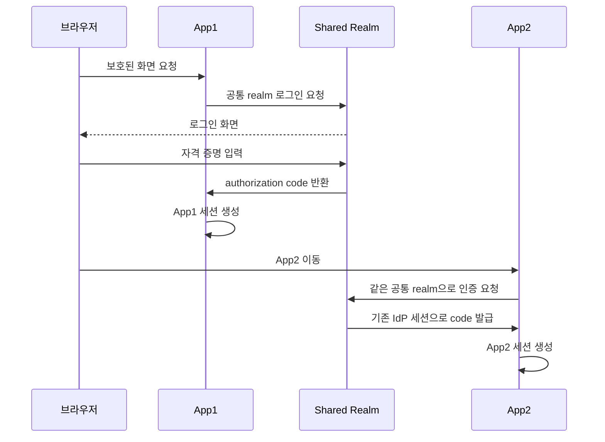
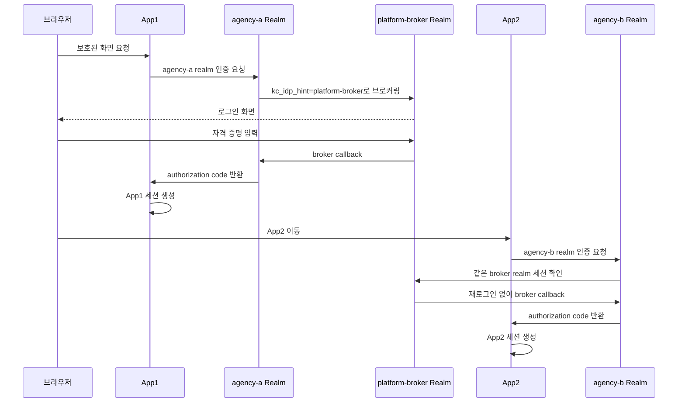
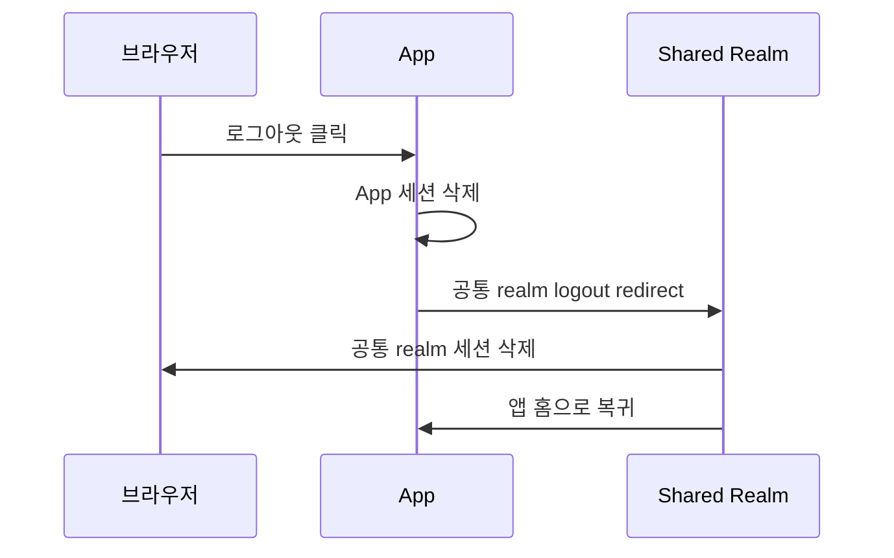
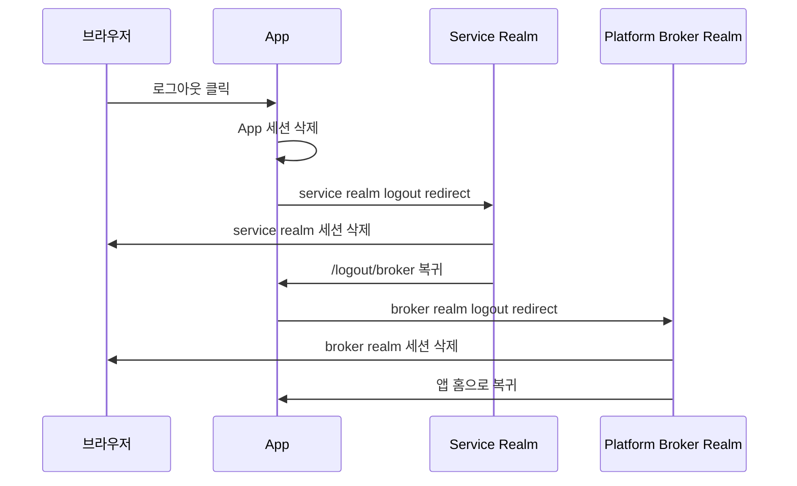

# OIDC Multi App Realm Broker Example

`oidc-multi-app-example`의 확장판으로, 앱별로 Keycloak realm을 분리하면서도 공통 SSO를 유지해야 할 때의 구조를 보여주는 예제입니다.

이 샘플은 `공통 realm + 앱별 client` 모델이 아니라, 아래처럼 `service realm + broker realm` 모델을 사용합니다.

```text
platform-broker realm
├─ 공통 로그인 허브
├─ 실제 사용자 인증
├─ 공통 SSO 세션
├─ broker client: agency-a-broker
├─ broker client: agency-b-broker
└─ logout client: platform-broker-logout

agency-a realm
├─ app1의 OIDC provider
├─ client: oidc-app1
├─ role: app1-user, app1-admin
└─ platform-broker identity provider 링크

agency-b realm
├─ app2의 OIDC provider
├─ client: oidc-app2
├─ role: app2-user, app2-admin
└─ platform-broker identity provider 링크
```

즉, 사용자는 App1과 App2 사이를 이동할 때 동일한 `platform-broker` 세션을 재사용하지만, 실제 인가 판단은 각 서비스 realm의 local user와 client role을 기준으로 다시 수행합니다.

## Repository Links

- 전체 저장소: [sample-repository-example](https://github.com/ydj515/sample-repository-example)
- 공통 realm 기본 예제: [oidc-multi-app-example](https://github.com/ydj515/sample-repository-example/tree/main/oidc-multi-app-example)
- 서비스별 realm + broker 예제: [oidc-multi-app-realm-broker-example](https://github.com/ydj515/sample-repository-example/tree/main/oidc-multi-app-realm-broker-example)
- Gateway HMAC 확장 예제: [oidc-multi-app-hmac-gateway-example](https://github.com/ydj515/sample-repository-example/tree/main/oidc-multi-app-hmac-gateway-example)

## 이 예제가 다루는 문제

- App1과 App2가 서로 다른 realm을 쓰면 왜 기본적으로 SSO가 깨지는가
- 그 상태에서 `platform-broker realm`을 두면 SSO가 어떻게 다시 성립하는가
- 사용자가 같은 broker 세션을 재사용해도 왜 App1과 App2 권한은 다시 분리되는가
- Spring Security에서 공통 realm 모델과 비교해 어떤 설정과 코드가 추가되는가
- 로그아웃 시 왜 `앱 세션`, `service realm 세션`, `broker realm 세션`을 구분해서 봐야 하는가

## 런타임 모델

| 로컬 데모 | 역할 |
| --- | --- |
| `http://localhost:8081` | App1 |
| `http://localhost:8082` | App2 |
| `http://localhost:9000/realms/agency-a` | App1이 신뢰하는 service realm |
| `http://localhost:9000/realms/agency-b` | App2가 신뢰하는 service realm |
| `http://localhost:9000/realms/platform-broker` | 공통 로그인 허브 realm |

핵심은 App1과 App2가 더 이상 같은 realm에 직접 붙지 않는다는 점입니다.

- App1은 `agency-a realm`의 `oidc-app1` client를 사용합니다.
- App2는 `agency-b realm`의 `oidc-app2` client를 사용합니다.
- 두 realm은 각각 `platform-broker`를 identity provider로 등록합니다.
- 앱 로그인 시작 시 `kc_idp_hint=platform-broker`를 붙여 사용자를 바로 broker realm으로 보냅니다.

## 구성

| 모듈/서비스 | 역할 | 대표 예시 |
| --- | --- | --- |
| `app1` | agency-a realm을 신뢰하는 첫 번째 앱 | 포트 `8081`, client `oidc-app1` |
| `app2` | agency-b realm을 신뢰하는 두 번째 앱 | 포트 `8082`, client `oidc-app2` |
| `oidc-common` | 공통 OIDC 보안 모듈 | 로그인, broker hint, logout 체인 |
| `session-common` | 공통 세션 모듈 | Redis 세션 저장, 조회, 강제 로그아웃 |
| `postgres` | Keycloak DB | Keycloak 26 영속 저장소 |
| `redis` | Spring Session 저장소 | 앱 세션 저장 |
| `keycloak` | 3개 realm을 가진 인증 서버 | `agency-a`, `agency-b`, `platform-broker` |

## 공통 realm 예제와 어디가 달라졌나

### 1. Provider endpoint가 앱마다 달라진다

`oidc-multi-app-example`에서는 두 앱 모두 같은 realm endpoint를 바라봤습니다.

이 예제에서는 다음처럼 갈라집니다.

```yaml
# app1/application-local.yaml
spring:
  security:
    oauth2:
      client:
        provider:
          keycloak:
            authorization-uri: http://localhost:9000/realms/agency-a/protocol/openid-connect/auth
            token-uri: http://localhost:9000/realms/agency-a/protocol/openid-connect/token
            user-info-uri: http://localhost:9000/realms/agency-a/protocol/openid-connect/userinfo
            jwk-set-uri: http://localhost:9000/realms/agency-a/protocol/openid-connect/certs
```

```yaml
# app2/application-local.yaml
spring:
  security:
    oauth2:
      client:
        provider:
          keycloak:
            authorization-uri: http://localhost:9000/realms/agency-b/protocol/openid-connect/auth
            token-uri: http://localhost:9000/realms/agency-b/protocol/openid-connect/token
            user-info-uri: http://localhost:9000/realms/agency-b/protocol/openid-connect/userinfo
            jwk-set-uri: http://localhost:9000/realms/agency-b/protocol/openid-connect/certs
```

### 2. 로그인 요청에 broker hint가 추가된다

공통 realm 모델에서는 `/oauth2/authorization/keycloak`만으로 충분했습니다.

서비스별 realm에서는 로그인 시작점이 service realm이지만, 실제 사용자 인증은 broker realm에서 일어나길 원합니다. 그래서 `oidc-common`에 `kc_idp_hint` 추가 로직이 들어갑니다.

```yaml
app:
  security:
    identity-provider-hint: platform-broker
```

```kotlin
class IdentityProviderHintAuthorizationRequestResolver(
    clientRegistrationRepository: ClientRegistrationRepository,
    private val identityProviderHint: String?,
) : OAuth2AuthorizationRequestResolver {

    private val delegate = DefaultOAuth2AuthorizationRequestResolver(
        clientRegistrationRepository,
        OAuth2AuthorizationRequestRedirectFilter.DEFAULT_AUTHORIZATION_REQUEST_BASE_URI,
    )

    override fun resolve(request: HttpServletRequest): OAuth2AuthorizationRequest? {
        return delegate.resolve(request)?.withIdentityProviderHint()
    }
}
```

### 3. 로그아웃도 두 단계가 된다

공통 realm 모델에서는 보통 `앱 세션 삭제 -> 공통 realm logout`으로 끝납니다.

이 예제에서는 기본 logout 후속 흐름이 아래처럼 이어집니다.

1. 앱 세션 삭제
2. 현재 service realm logout
3. `/logout/broker`로 리다이렉트
4. `platform-broker realm` logout
5. 앱 홈으로 복귀

설정은 아래처럼 둡니다.

```yaml
app:
  security:
    end-session-uri: http://localhost:9000/realms/agency-a/protocol/openid-connect/logout
    broker-logout:
      end-session-uri: http://localhost:9000/realms/platform-broker/protocol/openid-connect/logout
      client-id: platform-broker-logout
```

현재 샘플에서는 broker realm logout 단계에서 Keycloak 확인 화면이 한 번 더 나타날 수 있습니다. 이유는 애플리케이션이 `agency-a`, `agency-b`의 `id_token`은 갖고 있지만 `platform-broker`의 `id_token_hint`는 직접 들고 있지 않기 때문입니다. 이 점은 "service realm과 broker realm이 완전히 같은 세션 경계가 아니다"라는 사실을 오히려 잘 보여줍니다.

## Keycloak realm 구성

### `platform-broker`

- 공통 사용자 계정 저장
- 공통 SSO 세션 저장
- `agency-a-broker`, `agency-b-broker` client 제공
- `platform-broker-logout` client 제공

### `agency-a`

- `oidc-app1` client 보유
- `platform-broker` identity provider 등록
- `agency-a-user`, `multi-user`, `agency-a-admin`, `master-admin`은 App1 접근 가능
- `agency-b-user`, `agency-b-admin`은 broker login은 되지만 App1 role이 없어 `403`

### `agency-b`

- `oidc-app2` client 보유
- `platform-broker` identity provider 등록
- `agency-b-user`, `multi-user`, `agency-b-admin`, `master-admin`은 App2 접근 가능
- `agency-a-user`, `agency-a-admin`은 broker login은 되지만 App2 role이 없어 `403`

## 예제 계정

| 계정 | 비밀번호 | App1 | App2 | 설명 |
| --- | --- | --- | --- | --- |
| `agency-a-user` | `agencyauser1234` | 가능 | `403` | agency-a realm 전용 사용자 |
| `agency-b-user` | `agencybuser1234` | `403` | 가능 | agency-b realm 전용 사용자 |
| `multi-user` | `multi1234` | 가능 | 가능 | 두 realm 모두 연결된 데모 계정 |
| `agency-a-admin` | `agencyaadmin1234` | 가능 | `403` | App1 관리자 |
| `agency-b-admin` | `agencybadmin1234` | `403` | 가능 | App2 관리자 |
| `master-admin` | `master1234` | 가능 | 가능 | 전역 관리자 |

## 빠른 실행

```bash
docker compose up --build
```

접속 주소:

- App1: `http://localhost:8081`
- App2: `http://localhost:8082`
- Keycloak: `http://localhost:9000`

## 공통 realm과 로그인 흐름 비교

### 공통 realm 예제



### 서비스별 realm + broker 예제



차이는 분명합니다.

- 공통 realm 모델은 `같은 realm 세션`을 재사용합니다.
- 이 예제는 `같은 broker realm 세션`을 재사용합니다.
- 따라서 service realm이 바뀌어도 SSO는 유지되지만, 인가는 각 realm의 local user와 client role에서 다시 판단합니다.

## 공통 realm과 로그아웃 흐름 비교

### 공통 realm 예제



### 서비스별 realm + broker 예제



이 예제에서 중요한 점은 `service realm logout`만으로는 충분하지 않다는 것입니다. broker realm 세션이 남아 있으면 다음 로그인 시 다시 조용히 브로커링될 수 있기 때문에, 샘플 코드도 broker logout 후속 단계를 명시적으로 넣었습니다.

다만 broker logout 단계는 Keycloak 확인 화면이 한 번 더 보일 수 있습니다. 완전히 무중단 global logout UX를 만들려면 broker realm의 `id_token_hint`까지 안전하게 확보하는 추가 설계가 필요합니다.

## 검증 시나리오

1. `multi-user`로 App1 로그인
2. 같은 브라우저에서 App2 이동
3. platform-broker 로그인 화면이 다시 뜨지 않고 App2 세션이 새로 생기는지 확인
4. `agency-a-user`로 App1 로그인 후 App2 이동
5. broker 로그인은 재사용되지만 App2에서는 `403`이 나는지 확인
6. `agency-a-admin`으로 App1에서 강제 로그아웃 실행
7. App1 범위 세션만 종료되는지 확인

## 보안 모듈에서 실제로 바뀐 파일

- `oidc-common/.../OidcSecurityProperties.kt`
  - `identityProviderHint`
  - `brokerLogout`
- `oidc-common/.../OidcSecurityConfigurer.kt`
  - `IdentityProviderHintAuthorizationRequestResolver` 연결
- `oidc-common/.../KeycloakLogoutSuccessHandler.kt`
  - service realm logout 뒤 broker logout으로 이어지는 redirect 체인
- `oidc-common/.../BrokerLogoutController.kt`
  - broker realm logout을 마무리하는 전용 엔드포인트

## 언제 이 예제를 선택하나

- 서비스별로 realm 관리자 위임이 필요할 때
- 서비스별 client, role, mapper, 로그인 정책을 더 강하게 분리하고 싶을 때
- 그래도 사용자 경험은 공통 SSO처럼 유지하고 싶을 때

반대로 아래 조건이면 기본 예제인 `oidc-multi-app-example`이 더 단순하고 설명도 쉽습니다.

- 공통 사용자 풀과 공통 realm 하나로 충분할 때
- realm 분리보다 client 분리만으로도 운영이 가능한 때
- 서비스별 realm 관리자 경계가 아직 필요하지 않을 때
