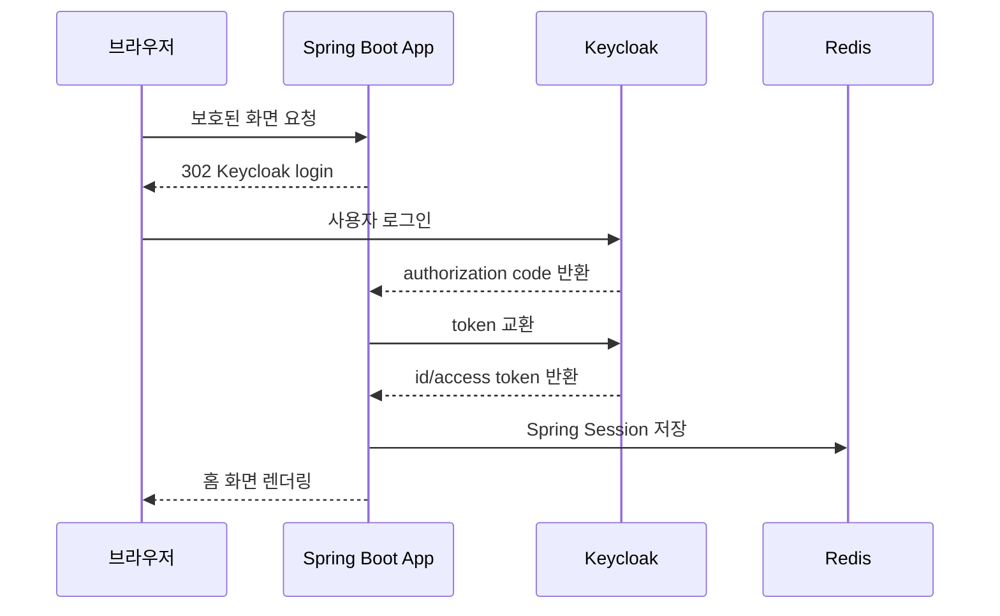

# OIDC Example

Kotlin + Spring Boot 기반으로 Keycloak OIDC 로그인, Redis 세션 저장, 세션 재검증, 관리자 강제 로그아웃 예시를 담은 샘플입니다.

## 구성

- Spring Boot 3.5 + Kotlin
- Spring Security OAuth2 Login
- Spring Session Redis
- Keycloak 26
- Docker Compose

## 빠른 실행

```bash
docker compose up --build
```

이미 컨테이너를 한 번 띄운 상태라면 Keycloak hostname 설정 반영을 위해 아래처럼 재시작하는 편이 안전합니다.

```bash
docker compose down
docker compose up --build
```

브라우저 접속 주소:

- 애플리케이션: `http://localhost:8080`
- Keycloak: `http://localhost:9000`

프로필:

- 로컬 실행: `local`
- Docker Compose 실행: `docker`

## 예제 계정

- 일반 사용자
  - 아이디: `alice`
  - 비밀번호: `alice1234`
- 관리자
  - 아이디: `app-admin`
  - 비밀번호: `admin1234`

## 주요 엔드포인트

- `GET /public`
- `GET /api/me`
- `GET /api/sensitive`
- `POST /api/admin/users/{username}/logout-all`

예시:

```bash
curl -X POST http://localhost:8080/api/admin/users/alice/logout-all \
  --cookie "SESSION=<관리자 세션 쿠키>"
```

## 로컬 앱 실행

Keycloak과 Redis만 먼저 실행한 뒤, 애플리케이션을 로컬에서 실행해도 됩니다.

```bash
docker compose up keycloak redis
./gradlew bootRun --args='--spring.profiles.active=local'
```

앱만 로컬에서 띄울 때는 `local` 프로필이 `localhost:9000`, `localhost:6379` 기준으로 동작합니다.
Docker Compose에서는 `docker` 프로필이 적용되어 Redis는 `redis`, Keycloak 백채널은 `keycloak:8080`을 사용합니다.

## 로그인 시퀀스



이 예제의 핵심은 OIDC 로그인으로 사용자 신원을 확인한 뒤, 애플리케이션이 그 결과를 자기 세션으로 다시 저장한다는 점입니다. 즉, 이후 요청에서는 매번 Keycloak에 다시 묻는 대신 Redis에 저장된 Spring Session을 기준으로 로그인 상태를 유지하고, 필요할 때만 세션 재검증이나 강제 로그아웃 정책을 적용합니다.

## 로그인 문제가 생길 때

Keycloak 로그에 아래 메시지가 보이면:

```text
Invalid token issuer. Expected 'http://keycloak:8080/realms/oidc-example'
```

브라우저는 `localhost:9000`으로 로그인하고, 앱 컨테이너는 `keycloak:8080`으로 UserInfo를 호출해서 issuer 기준이 달라진 상황입니다.
이 저장소의 `docker-compose.yml`은 `KC_HOSTNAME`과 `KC_HOSTNAME_BACKCHANNEL_DYNAMIC`으로 이 문제를 해결하도록 맞춰두었습니다.

## 로그아웃 문제가 생길 때

로그아웃 시 Keycloak 화면에 아래 메시지가 보이면:

```text
Invalid redirect uri
```

Keycloak client의 `post logout redirect uri` 허용 목록에 `http://localhost:8080/`가 없어서 발생한 것입니다.
이 저장소의 realm import는 해당 주소를 명시적으로 포함하도록 맞춰두었습니다.

반영 방법:

```bash
docker compose down
docker compose up --build
```

재기동 후에도 같은 메시지가 보이면 브라우저 쿠키를 지우고 다시 로그인한 뒤 로그아웃을 확인해보면 됩니다.
