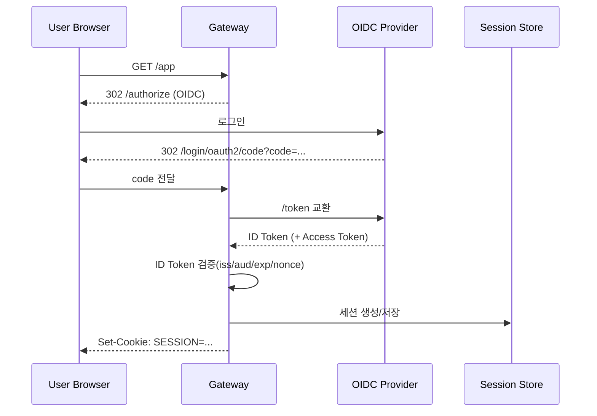
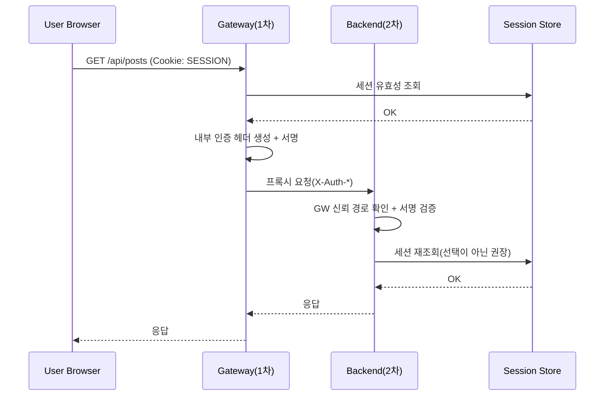
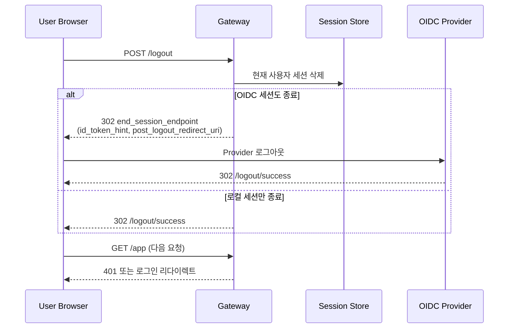
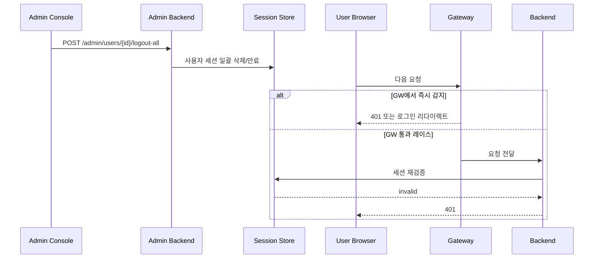

## OIDC를 "로그인 기술"로만 보면 놓치는 것들

OIDC(OpenID Connect)는 OAuth 2.0 위에 "사용자 인증(로그인)"을 올린 표준입니다.
문서에서 보면 개념은 간단해 보이지만, 실제 서비스에서는 아래 질문이 바로 따라옵니다.

- 로그인 이후 요청 신뢰를 어디서, 어떻게 보장할 것인가
- 관리자 강제 로그아웃은 어떻게 즉시 반영할 것인가
- Gateway와 Backend가 동시에 검증할 때 책임 경계를 어떻게 나눌 것인가
- 성능과 보안을 어디서 트레이드오프할 것인가

이 글은 "OIDC 로그인 자체"보다, **OIDC 이후의 요청 검증과 운영 설계**를 중심으로 정리합니다.

## 먼저 정리: OAuth 2.0과 OIDC는 무엇이 다른가

OAuth 2.0은 "인가(Authorization)" 표준이고, OIDC는 "인증(Authentication)" 표준입니다.

- OAuth 2.0 Access Token: 리소스 접근 권한을 표현
- OIDC ID Token: 로그인한 사용자 신원을 표현

즉, "사용자가 누구인지"를 표준 방식으로 확인하려면 OIDC가 필요합니다.

## 이 글의 설계 조건

아래 조건을 만족하는 구조를 기준으로 설명합니다.

- OIDC Provider: `auth.example.com`
- Gateway: `gw.example.com`
- Backend: `api.example.com` (복수 서비스 가능)
- 세션 저장소: Spring Session + Redis/JDBC 같은 중앙 저장소
- 목표: 관리자 강제 로그아웃 가능, 내부 위변조 방어, 서비스 간 일관된 인증 컨텍스트

## 이 글의 버전 기준(2026-03-08)

샘플 코드는 아래 버전을 기준으로 작성했습니다.

| 구성요소 | 권장 버전 라인 | 비고 |
| --- | --- | --- |
| Java | `21` | LTS 기준 |
| Spring Boot | `3.4.x` | BOM 기준으로 하위 의존성 정렬 |
| Spring Framework | `6.2.x` | Boot 3.4.x 라인과 정합 |
| Spring Security | `6.4.x` | Boot 관리 버전 사용 권장 |
| Spring Cloud | `2024.0.x` | Gateway 사용 시 Boot와 호환 라인 고정 |
| Spring Cloud Gateway | `4.2.x` | Spring Cloud 2024.0.x 라인 |

버전은 "메이저/마이너 라인"을 먼저 맞추고, 패치는 최신으로 유지하는 방식이 운영 리스크를 줄입니다.

## OIDC Provider 후보 비교

OIDC를 적용한다고 했을 때 실제로는 "어떤 Provider를 쓸지"가 설계의 절반입니다.
아래는 실무에서 자주 선택하는 후보를 같은 관점으로 비교한 표입니다.

| 제품 | 운영 모델 | 강점 | 주의할 점 | 추천 상황 |
| --- | --- | --- | --- | --- |
| Keycloak | Self-host(오픈소스) | 커스터마이징, 데이터/인증 흐름 통제, 벤더 종속도 완화 | 업그레이드/HA/백업/보안패치까지 직접 운영 필요 | 규제/망분리/온프레미스 요구가 강한 조직 |
| Auth0 | SaaS | 빠른 도입, 풍부한 CIAM 기능, 관리형 운영 | 비용 구조와 벤더 종속 고려 필요 | 빠른 출시와 사용자 경험이 중요한 서비스 |
| Okta | SaaS | 엔터프라이즈 SSO/정책/거버넌스 강점 | 조직/비용/계약 단위 의사결정 필요 | 기업 내부 계정 통합, B2E 중심 |
| Microsoft Entra ID | SaaS | M365/AD 생태계 연동 강점, 기업 계정 통합 용이 | 테넌트/정책 모델 이해 필요 | Microsoft 중심 조직, 하이브리드 AD |
| Amazon Cognito | SaaS(AWS) | AWS 서비스 통합, 인프라 일관성 | 고급 인증 UX 커스터마이징은 추가 설계 필요 | AWS 중심 아키텍처, 인프라 단순화 우선 |

요즘 많이 선택하는 패턴(2026년 1분기 기준, 절대 점유율 통계가 아닌 실무 선택 경향):

- 엔터프라이즈(B2E)에서는 `Microsoft Entra ID`와 `Okta`가 자주 선택됩니다. 이유: 기존 사내 계정 체계(AD/M365) 연동, SSO/거버넌스/감사 체계를 빠르게 붙이기 쉽기 때문입니다.
- AWS 중심 서비스에서는 `Amazon Cognito` 채택이 많습니다. 이유: 인프라 스택을 AWS로 통일해 운영 복잡도를 낮추고, OIDC/SAML 연동을 관리형으로 가져가기 쉽기 때문입니다.
- 규제/망분리/온프레미스 요구가 강한 조직은 `Keycloak`을 많이 검토합니다. 이유: 자체 호스팅으로 인증 데이터와 커스터마이징 통제권을 유지할 수 있기 때문입니다.
- 빠른 출시가 중요한 CIAM 시나리오에서는 `Auth0`가 자주 선택됩니다. 이유: 기본 기능 완성도가 높아 초기 구축 리드타임을 줄이기 쉽기 때문입니다.

선택 기준은 아래 4가지를 먼저 고정하면 됩니다.

- 규제/데이터 주권: 인증 데이터 보관 위치와 통제 수준
- 운영 역량: 24x7 운영, 업그레이드, 장애 대응 인력 보유 여부
- 제품 전략: B2C/CIAM 중심인지, B2E/SSO 중심인지
- 비용 구조: 초기 구축비 vs 장기 운영비(TCO)

비교를 로그인/API 흐름에 대입하면, 실제로 달라지는 지점은 아래 4개입니다.

- Discovery Endpoint: `/.well-known/openid-configuration`
- 인증/토큰 Endpoint 주소와 클라이언트 인증 방식
- Logout 지원 방식(RP-Initiated, Front/Back-channel 지원 범위)
- 관리자 세션 강제 만료를 위한 Provider API/콘솔 연동 방식

공식 문서:

- [Keycloak OIDC 문서](https://www.keycloak.org/securing-apps/oidc-layers)
- [Auth0 OpenID Connect 문서](https://auth0.com/docs/authenticate/protocols/openid-connect-protocol)
- [Okta OIDC API 문서](https://developer.okta.com/docs/reference/api/oidc/)
- [Microsoft Entra ID OIDC 문서](https://learn.microsoft.com/en-us/entra/identity-platform/v2-protocols-oidc)
- [Amazon Cognito OIDC 관련 문서](https://docs.aws.amazon.com/cognito/latest/developerguide/cognito-user-pools-oidc-flow.html)

## 로그인 흐름: Authorization Code + 서버 세션



핵심은 다음입니다.

- OIDC는 로그인 순간에 집중적으로 쓰입니다.
- 로그인 이후 브라우저는 `SESSION` 쿠키 기반으로 동작합니다.
- 강제 로그아웃은 중앙 세션 삭제로 제어할 수 있습니다.

## API 요청 흐름: Gateway 1차 + Backend 2차 검증



### 왜 Backend 2차 검증이 필요한가

Gateway를 통과했다는 사실만으로 충분하지 않습니다.
실무에서는 아래 리스크가 반복됩니다.

- 내부 네트워크 오인증(설정 누락, 우회 경로)
- `X-Auth-*` 헤더 위변조
- 강제 로그아웃 직후의 레이스 컨디션

Backend가 세션을 재검증하면 마지막 방어선이 생깁니다.

## OIDC에서 실무적으로 반드시 확인해야 할 검증 포인트

### ID Token 검증

- `iss`: 신뢰하는 발급자(Provider)인지
- `aud`: 현재 클라이언트용 토큰인지
- `exp`, `iat`, `nbf`: 시간 유효 범위인지
- `nonce`: 로그인 요청-응답 재사용 공격 방지
- `alg`, `kid`, JWKS: 서명 키 선택/검증 일치 여부

### Authorization 요청 보호

- `state`: CSRF 대응
- PKCE(`code_verifier`, `code_challenge`): 코드 탈취 리스크 축소

### 쿠키/세션 보호

- `Secure`, `HttpOnly`, `SameSite` 설정
- 서브도메인 전략에 맞는 Domain 설정
- 세션 TTL, 절대 만료, 유휴 만료 정책 분리

## 로그아웃 흐름: 사용자 로그아웃 + OIDC 세션 종료



핵심 포인트:

- 애플리케이션 세션 삭제만으로 끝내지 말고, 필요하면 Provider 세션도 함께 종료해야 재로그인 정책이 일관됩니다.
- `post_logout_redirect_uri`는 Provider에 사전 등록된 값만 허용해야 오픈 리다이렉트 위험을 줄일 수 있습니다.

## 강제 로그아웃 흐름: 관리자 주도 세션 무효화



핵심 포인트:

- 관리자 강제 로그아웃은 "세션 저장소 삭제"가 기준 동작이며, 토큰 블랙리스트보다 반영이 직관적입니다.
- GW/Backend 사이에 레이스가 있어도 Backend 2차 재검증이 최종 차단선 역할을 합니다.

## 성능 관점: 2차 검증이 느려지지 않게 하는 방법

세션 저장소를 매요청 조회하면 비용이 증가할 수 있습니다. 다음처럼 완화할 수 있습니다.

- 초단기 캐시(예: 1~5초) + 세션 버전(revision) 확인
- 사용자 권한 변경 시 버전 증가로 캐시 무효화
- 읽기 부하가 큰 경우 Redis 샤딩/복제 구성
- 중요한 API만 강한 검증(정책 기반 차등 적용)

## 공통 보안 라이브러리로 분리할 때의 체크리스트

Backend마다 보안 로직을 복붙하면 반드시 어긋납니다. 공통 모듈로 고정하는 것이 좋습니다.

- 외부 주입 인증 헤더 제거(신뢰 경계 정리)
- Gateway 기원 확인(mTLS, 내부망, allowlist)
- 헤더 서명 검증(HMAC 또는 비대칭 서명)
- 세션 재검증 및 SecurityContext 구성
- 실패 응답 표준화(401/403, 에러 코드, 감사 로그)

## Spring Cloud Gateway 샘플: 1차 검증 필터

아래 예시는 Gateway에서 세션을 확인하고, Backend 전달용 내부 헤더를 구성하는 최소 예시입니다.

```java
package com.example.gateway.security;

import java.nio.charset.StandardCharsets;
import java.time.Instant;
import java.util.Base64;

import javax.crypto.Mac;
import javax.crypto.spec.SecretKeySpec;

import org.springframework.beans.factory.annotation.Value;
import org.springframework.cloud.gateway.filter.GatewayFilterChain;
import org.springframework.cloud.gateway.filter.GlobalFilter;
import org.springframework.core.Ordered;
import org.springframework.http.HttpStatus;
import org.springframework.stereotype.Component;
import org.springframework.web.server.ServerWebExchange;

import reactor.core.publisher.Mono;

@Component
public class SessionValidationFilter implements GlobalFilter, Ordered {

    private static final String HMAC_SHA256 = "HmacSHA256";
    private static final String SESSION_COOKIE = "SESSION";

    private final SessionLookupService sessionLookupService;
    private final byte[] signingKey;

    public SessionValidationFilter(
            SessionLookupService sessionLookupService,
            @Value("${security.internal-signing-key}") String signingKey) {
        this.sessionLookupService = sessionLookupService;
        this.signingKey = signingKey.getBytes(StandardCharsets.UTF_8);
    }

    @Override
    public Mono<Void> filter(ServerWebExchange exchange, GatewayFilterChain chain) {
        String sessionId = exchange.getRequest().getCookies().getFirst(SESSION_COOKIE) != null
                ? exchange.getRequest().getCookies().getFirst(SESSION_COOKIE).getValue()
                : null;

        if (sessionId == null || sessionId.isBlank()) {
            exchange.getResponse().setStatusCode(HttpStatus.UNAUTHORIZED);
            return exchange.getResponse().setComplete();
        }

        return sessionLookupService.findAuthenticatedUser(sessionId)
                .switchIfEmpty(unauthorized(exchange))
                .flatMap(user -> {
                    long iat = Instant.now().getEpochSecond();
                    String payload = user.userId() + "|" + user.rolesCsv() + "|" + sessionId + "|" + iat;
                    String signature = hmac(payload);

                    ServerWebExchange mutated = exchange.mutate()
                            .request(req -> req.headers(headers -> {
                                // 외부에서 주입될 수 있는 내부 헤더는 Gateway에서 덮어쓴다.
                                headers.set("X-Auth-UserId", user.userId());
                                headers.set("X-Auth-Roles", user.rolesCsv());
                                headers.set("X-Auth-SessionId", sessionId);
                                headers.set("X-Auth-Iat", String.valueOf(iat));
                                headers.set("X-Auth-Signature", signature);
                            }))
                            .build();

                    return chain.filter(mutated);
                });
    }

    private Mono<AuthenticatedUser> unauthorized(ServerWebExchange exchange) {
        exchange.getResponse().setStatusCode(HttpStatus.UNAUTHORIZED);
        return exchange.getResponse().setComplete().then(Mono.empty());
    }

    private String hmac(String value) {
        try {
            Mac mac = Mac.getInstance(HMAC_SHA256);
            mac.init(new SecretKeySpec(signingKey, HMAC_SHA256));
            return Base64.getEncoder().encodeToString(mac.doFinal(value.getBytes(StandardCharsets.UTF_8)));
        } catch (Exception e) {
            throw new IllegalStateException("failed to sign internal auth header", e);
        }
    }

    @Override
    public int getOrder() {
        return -100;
    }
}
```

> 운영에서는 `X-Auth-*`를 외부 경로에서 수신하지 않도록 L7/WAF/Gateway route 정책으로 먼저 차단해야 합니다.

## Spring Security 샘플: Backend 2차 검증 필터/인터셉터

Backend에서는 `OncePerRequestFilter`로 인증 컨텍스트를 만들고, `HandlerInterceptor`로 API 등급별 재검증 강도를 적용하면 운영 제어가 쉬워집니다.

```java
package com.example.backend.security;

import java.io.IOException;
import java.nio.charset.StandardCharsets;
import java.util.Base64;

import javax.crypto.Mac;
import javax.crypto.spec.SecretKeySpec;

import jakarta.servlet.FilterChain;
import jakarta.servlet.ServletException;
import jakarta.servlet.http.HttpServletRequest;
import jakarta.servlet.http.HttpServletResponse;

import org.springframework.beans.factory.annotation.Value;
import org.springframework.security.authentication.UsernamePasswordAuthenticationToken;
import org.springframework.security.core.context.SecurityContextHolder;
import org.springframework.security.web.authentication.WebAuthenticationDetailsSource;
import org.springframework.stereotype.Component;
import org.springframework.web.filter.OncePerRequestFilter;

@Component
public class InternalAuthFilter extends OncePerRequestFilter {

    private final byte[] signingKey;

    public InternalAuthFilter(
            @Value("${security.internal-signing-key}") String signingKey) {
        this.signingKey = signingKey.getBytes(StandardCharsets.UTF_8);
    }

    @Override
    protected void doFilterInternal(
            HttpServletRequest request,
            HttpServletResponse response,
            FilterChain filterChain) throws ServletException, IOException {

        String userId = request.getHeader("X-Auth-UserId");
        String roles = request.getHeader("X-Auth-Roles");
        String sessionId = request.getHeader("X-Auth-SessionId");
        String iat = request.getHeader("X-Auth-Iat");
        String signature = request.getHeader("X-Auth-Signature");

        if (userId == null || roles == null || sessionId == null || iat == null || signature == null) {
            response.sendError(HttpServletResponse.SC_UNAUTHORIZED, "missing auth headers");
            return;
        }

        String payload = userId + "|" + roles + "|" + sessionId + "|" + iat;
        if (!hmac(payload).equals(signature)) {
            response.sendError(HttpServletResponse.SC_UNAUTHORIZED, "invalid signature");
            return;
        }

        // 이 단계는 헤더 무결성 검증, 실제 세션 상태는 인터셉터 정책에 따라 재검증.
        InternalPrincipal principal = new InternalPrincipal(userId, roles, sessionId);
        UsernamePasswordAuthenticationToken auth =
                new UsernamePasswordAuthenticationToken(principal, null, principal.authorities());
        auth.setDetails(new WebAuthenticationDetailsSource().buildDetails(request));
        SecurityContextHolder.getContext().setAuthentication(auth);

        filterChain.doFilter(request, response);
    }

    private String hmac(String value) {
        try {
            Mac mac = Mac.getInstance("HmacSHA256");
            mac.init(new SecretKeySpec(signingKey, "HmacSHA256"));
            return Base64.getEncoder().encodeToString(mac.doFinal(value.getBytes(StandardCharsets.UTF_8)));
        } catch (Exception e) {
            throw new IllegalStateException("failed to verify signature", e);
        }
    }
}
```

```java
package com.example.backend.security;

import jakarta.servlet.http.HttpServletRequest;
import jakarta.servlet.http.HttpServletResponse;

import org.springframework.stereotype.Component;
import org.springframework.web.servlet.HandlerInterceptor;

@Component
public class SessionRevalidationInterceptor implements HandlerInterceptor {

    private final SessionLookupService sessionLookupService;
    private final ApiSecurityTierResolver tierResolver;

    public SessionRevalidationInterceptor(
            SessionLookupService sessionLookupService,
            ApiSecurityTierResolver tierResolver) {
        this.sessionLookupService = sessionLookupService;
        this.tierResolver = tierResolver;
    }

    @Override
    public boolean preHandle(HttpServletRequest request, HttpServletResponse response, Object handler) throws Exception {
        InternalPrincipal principal = (InternalPrincipal) request.getUserPrincipal();
        ApiSecurityLevel tier = tierResolver.resolve(request, handler);

        boolean valid = switch (tier) {
            case P0_CRITICAL -> sessionLookupService.revalidateAlways(principal.sessionId(), principal.userId());
            case P1_SENSITIVE -> sessionLookupService.revalidateWithShortCache(principal.sessionId(), principal.userId(), 1);
            case P2_STANDARD -> sessionLookupService.revalidateWithShortCache(principal.sessionId(), principal.userId(), 5);
            case P3_READ_HEAVY -> sessionLookupService.revalidateWithShortCache(principal.sessionId(), principal.userId(), 15);
        };

        if (!valid) {
            response.sendError(HttpServletResponse.SC_UNAUTHORIZED, "session invalid");
            return false;
        }

        return true;
    }
}
```

URI 규칙 대신 애노테이션 기반으로 분류하려면 아래처럼 구성하면 됩니다.

```java
package com.example.backend.security;

public enum ApiSecurityLevel {
    P0_CRITICAL,
    P1_SENSITIVE,
    P2_STANDARD,
    P3_READ_HEAVY
}
```

```java
package com.example.backend.security;

import java.lang.annotation.ElementType;
import java.lang.annotation.Retention;
import java.lang.annotation.RetentionPolicy;
import java.lang.annotation.Target;

@Target({ElementType.TYPE, ElementType.METHOD})
@Retention(RetentionPolicy.RUNTIME)
public @interface ApiSecurityTier {
    ApiSecurityLevel value();
}
```

```java
package com.example.backend.security;

import jakarta.servlet.http.HttpServletRequest;

import org.springframework.stereotype.Component;
import org.springframework.web.method.HandlerMethod;

@Component
public class ApiSecurityTierResolver {

    private static final ApiSecurityLevel DEFAULT_TIER = ApiSecurityLevel.P2_STANDARD;

    public ApiSecurityLevel resolve(HttpServletRequest request, Object handler) {
        if (handler instanceof HandlerMethod handlerMethod) {
            ApiSecurityLevel methodTier = extractMethodTier(handlerMethod);
            if (methodTier != null) {
                return methodTier;
            }

            ApiSecurityLevel classTier = extractClassTier(handlerMethod);
            if (classTier != null) {
                return classTier;
            }
        }

        // 핸들러 매핑이 없는 경우(정적 리소스, 에러 라우팅 등)는 기본 등급 사용
        return DEFAULT_TIER;
    }

    private ApiSecurityLevel extractMethodTier(HandlerMethod handlerMethod) {
        ApiSecurityTier annotation =
                handlerMethod.getMethodAnnotation(ApiSecurityTier.class);
        return annotation != null ? annotation.value() : null;
    }

    private ApiSecurityLevel extractClassTier(HandlerMethod handlerMethod) {
        ApiSecurityTier annotation =
                handlerMethod.getBeanType().getAnnotation(ApiSecurityTier.class);
        return annotation != null ? annotation.value() : null;
    }
}
```

컨트롤러에서는 클래스 기본 등급 + 메서드 override 방식으로 적용할 수 있습니다.

```java
package com.example.backend.api;

import org.springframework.web.bind.annotation.GetMapping;
import org.springframework.web.bind.annotation.PostMapping;
import org.springframework.web.bind.annotation.RequestMapping;
import org.springframework.web.bind.annotation.RestController;

import com.example.backend.security.ApiSecurityLevel;
import com.example.backend.security.ApiSecurityTier;

@RestController
@RequestMapping("/api/users")
@ApiSecurityTier(ApiSecurityLevel.P2_STANDARD)
public class UserController {

    @GetMapping("/{id}/profile")
    public String getProfile() {
        return "ok";
    }

    @PostMapping("/{id}/password")
    @ApiSecurityTier(ApiSecurityLevel.P1_SENSITIVE)
    public String changePassword() {
        return "ok";
    }
}
```

실무에서는 메서드 레벨 정책이 클래스 레벨 정책보다 우선되도록 고정하는 것이 운영 혼선을 줄입니다.

인터셉터를 실제로 적용하려면 MVC 설정에 등록해야 합니다.

```java
package com.example.backend.config;

import org.springframework.context.annotation.Configuration;
import org.springframework.web.servlet.config.annotation.InterceptorRegistry;
import org.springframework.web.servlet.config.annotation.WebMvcConfigurer;

import com.example.backend.security.SessionRevalidationInterceptor;

@Configuration
public class SecurityWebMvcConfig implements WebMvcConfigurer {

    private final SessionRevalidationInterceptor sessionRevalidationInterceptor;

    public SecurityWebMvcConfig(SessionRevalidationInterceptor sessionRevalidationInterceptor) {
        this.sessionRevalidationInterceptor = sessionRevalidationInterceptor;
    }

    @Override
    public void addInterceptors(InterceptorRegistry registry) {
        registry.addInterceptor(sessionRevalidationInterceptor)
                .addPathPatterns("/api/**");
    }
}
```

## 샘플 코드는 바로 적용 가능한가

결론부터 말하면, **구조는 바로 적용 가능하지만 코드는 프로젝트에 맞춘 매핑이 필요**합니다.

이 글의 코드는 아키텍처 뼈대를 보여주는 "레퍼런스 코드"입니다.
아래 5가지는 반드시 프로젝트에 맞게 구현해야 운영에 올릴 수 있습니다.

- `SessionLookupService`: 실제 세션 저장소(Redis/JDBC) 조회/캐시 전략
- `InternalPrincipal`: 권한 모델(Role/Scope)과 Spring Security `GrantedAuthority` 매핑
- 서명 키 관리: `security.internal-signing-key`를 KMS/Vault 등 외부 비밀 저장소로 관리
- 신뢰 경계 고정: Gateway 이외 경로에서 `X-Auth-*` 유입 차단(mTLS, LB/WAF, 네트워크 정책)
- 에러 표준화: `401/403` 코드와 감사 로그 포맷 통일

적용 난이도를 줄이려면 다음 순서가 안정적입니다.

1. P0/P1 API만 먼저 2차 재검증 적용
2. 운영 로그/지표(401율, 재검증 지연, 캐시 hit ratio) 관측
3. P2/P3로 점진 확장

## 현재 운영 환경 기준: API 등급별 세션 재검증 정책표

아래 표는 "보안 우선 + 성능 균형"을 위한 기본 운영안입니다.

| 등급 | 대상 API 예시 | Backend 세션 재검증 | 캐시 TTL | 실패 시 동작 |
| --- | --- | --- | --- | --- |
| `P0_CRITICAL` | 송금/결제 확정, 관리자 권한 변경, 계정 잠금 해제 | 매 요청 강제 재검증 | `0초` | 즉시 `401`, 감사 로그 필수 |
| `P1_SENSITIVE` | 개인정보 조회/수정, 비밀번호 변경, 토큰 재발급 | 요청마다 재검증(1초 캐시 허용) | `1초` | `401` + 사용자 이벤트 로깅 |
| `P2_STANDARD` | 일반 업무 API, 상태 변경 API | 짧은 캐시 기반 재검증 | `5초` | `401`, 재시도 없음 |
| `P3_READ_HEAVY` | 대량 조회, 통계 조회, 검색 API | 캐시 우선 + 주기 재검증 | `15초` | `401` 또는 soft-fail 정책(선택) |

등급 분류 기준은 아래처럼 시작하면 실무에서 충돌이 적습니다.

- 데이터 민감도(개인정보/권한/금전)
- 변경 불가역성(실수 복구 가능 여부)
- 규제/감사 필요성(감사로그, 접근통제 증적)
- 트래픽 특성(읽기 집중 vs 쓰기 집중)

## 문제 해결 관점 정리

### 조건

- 인증은 OIDC 표준을 따른다.
- 로그인 이후는 세션으로 운영한다.
- 강제 로그아웃은 즉시 반영 가능해야 한다.
- 내부 위변조/우회 요청에 방어력이 있어야 한다.

### 선택한 접근

- `OIDC 로그인 + 중앙 세션 + Gateway 1차 + Backend 2차 검증`

### 이유

- 인증 표준(OIDC)과 운영 제어(세션 강제 만료)를 동시에 만족하기 쉽다.
- Gateway 장애/오설정 시에도 Backend가 마지막 검증선을 제공한다.

### 복잡도

- 시간 복잡도(Time Complexity): 요청 1건당 검증은 고정 단계이므로 `O(1)`
- 공간 복잡도(Space Complexity): 사용자 수를 `U`, 평균 동시 세션 수를 `S`라 할 때 중앙 세션 저장소는 `O(U * S)`

### 주의사항

> - Access Token/ID Token을 혼용하면 권한 검증과 신원 검증 경계가 무너집니다.
> - 세션 재검증을 생략하면 강제 로그아웃 반영 지연과 내부 우회 공격 노출이 커집니다.
> - SameSite/Domain/CORS 설정이 어긋나면 인증 자체가 간헐적으로 실패합니다.
> - 로그에 토큰/세션 ID 원문을 남기지 않도록 마스킹 정책을 강제해야 합니다.

### 대안

- 대안 1: 순수 JWT 무상태 검증(GW/Backend 로컬 검증)
    - 장점: 세션 저장소 조회가 없어 지연이 낮고 수평 확장이 단순함
    - 단점: 강제 로그아웃/즉시 권한 회수가 어려워 별도 블랙리스트 또는 짧은 만료 전략이 필요함

- 대안 2: Gateway 단독 검증 + Backend 신뢰
    - 장점: Backend 구현 단순, 운영 포인트 축소
    - 단점: Gateway 오설정/우회 경로가 생기면 피해 반경이 커짐

## 어떤 경우에 이 구조를 선택하면 좋은가

아래 요구가 강하면 현재 구조가 잘 맞습니다.

- B2B/B2E처럼 권한 회수 즉시성 요구가 높다.
- 운영팀이 사용자 세션을 중앙에서 통제해야 한다.
- Gateway 외에도 내부 보안 경계를 추가로 두고 싶다.
- 서비스 수가 많아 인증/인가 규칙을 표준화해야 한다.

## 마무리

OIDC를 "로그인 성공"에서 끝내면 운영 단계에서 문제가 반복됩니다.
실무에서는 **로그인 이후 요청을 어떻게 지속적으로 신뢰할지**가 핵심입니다.

정리하면, OIDC는 시작점이고, 실제 안정성은 아래 3가지에서 결정됩니다.

- 중앙 세션 전략
- Gateway 1차 + Backend 2차 검증
- 강제 로그아웃을 포함한 운영 프로세스

이 3가지를 함께 설계하면, 인증 체계가 기능이 아니라 운영 가능한 시스템으로 바뀝니다.
